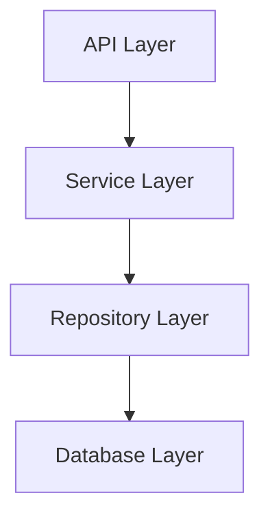

# IRADocument API

## Overview
The IRADocument API project is an asynchronous FastAPI application designed to facilitate project management and analysis through repository interactions. It integrates various modular components that encompass project orchestration, repository management, technology stack detection, and dynamic analysis workflows, all working in tandem to deliver robust performance and transparent output. The architecture employs SQLModel with AsyncSession to ensure efficient database operations, while leveraging Pydantic for request validation and structured error handling throughout the system. Furthermore, the integration of AI capabilities fosters advanced analysis and decision-making processes, positioning it as a powerful tool for software project assessments.

## Tech Stack
- **Language**: Python
- **Frameworks**: FastAPI, SQLModel, Pydantic
- **Databases**: SQLite, PostgreSQL
- **Libraries**: httpx, aiofiles, git

## High-Level Architecture

In this high-level architecture, incoming requests are first handled by the API Layer (FastAPI), which communicates with the Service Layer to orchestrate logic and data processing. The Service Layer interacts with the Repository Layer for database operations, culminating in data persistence within the Database Layer (SQLite/PostgreSQL).

## Key Components
1. **Project Services**  
   - **Type**: Service  
   - **Description**: Handles project orchestration and management utilizing asynchronous database operations with advanced AI analysis capabilities.  
   - **Dependencies**: SQLModel, AsyncSession, AgentExecutor, LLMFactory

2. **Infrastructure Module**  
   - **Type**: Service  
   - **Description**: Manages Git repository interactions, including cloning and workspace management, ensuring configurations are securely handled through environment variables.
   - **Dependencies**: git, httpx

3. **Pipeline Execution**  
   - **Type**: Service  
   - **Description**: Orchestrates the analysis workflow of projects, ensuring smooth execution of analysis steps and maintaining shared state across the pipeline.
   - **Dependencies**: AnalysisPipeline, PipelineContext

4. **Agents Module**  
   - **Type**: Service  
   - **Description**: Performs dynamic project assessment through tailored analysis stages using various AI tools, ensuring operational transparency throughout the process.
   - **Dependencies**: TechnologyScanner, AgentExecutor

5. **Data Models**  
   - **Type**: Model  
   - **Description**: Defines the structural representation of projects and their relational components using SQLModel to ensure data integrity across entities.
   - **Dependencies**: SQLModel

6. **Storage Management**  
   - **Type**: Repository  
   - **Description**: Facilitates CRUD operations and specific retrieval tailored for project-related entities, enhancing asynchronous data handling with SQLModel.
   - **Dependencies**: BaseRepository

7. **Core Functionality**  
   - **Type**: Utility  
   - **Description**: Provides foundational features for logging, database connections, and application configuration management to support efficient operations.
   - **Dependencies**: logging, SQLModel, Pydantic

8. **Scanning Utilities**  
   - **Type**: Utility  
   - **Description**: Identifies and analyzes project metadata and technology stacks through dedicated scanner classes, promoting extensibility for future additions.
   - **Dependencies**: TechnologyScanner

## Data Flow
In the IRADocument API, a request begins at the FastAPI layer, which routes it to the respective service in the app/services module. The service orchestrates the call to the appropriate agent or pipeline, which may involve asynchronous database interactions via SQLModel for data retrieval/manipulation. During processing, the data may flow into the storage layer for persistence and is subsequently analyzed within different stages of the pipeline. Error handling is implemented at multiple levels to ensure robust workflows, while logging provides tracking throughout the request lifecycle.

## Infrastructure
The application is designed to be containerized using Docker for efficient deployment, offering isolated environments tailored for different stages of project analysis and management.