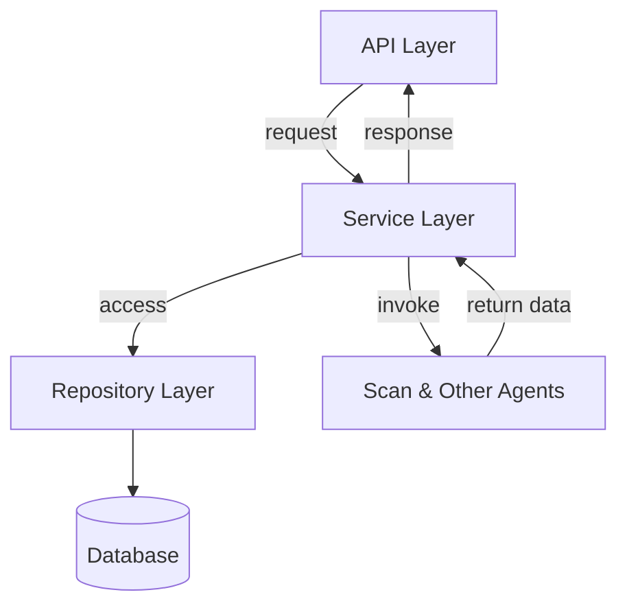

# IRA Document Generation and Analysis

## Overview

The IRA Document Generation and Analysis project is designed to streamline project analysis and documentation through a modular architecture leveraging asynchronous programming. The system integrates various components, including data management, analysis pipelines, and technology detection across multiple programming ecosystems. By combining FastAPI for API services, SQLModel for data interactions, and a suite of scanners for technology identification, the application facilitates dynamic and efficient project lifecycle management, ensuring robust error handling and clear documentation of process steps.

The architecture emphasizes asynchronous operations for improved scalability, and utilizes an extensive set of services to support various functionalities like file management, project relation handling, and usage of machine learning models for analysis purposes. Aiming for extensibility and maintainability, the project employs a microservices approach, ensuring that components can be individually developed, tested, and scaled.

## Technology Stack

- **Language**: Python  
- **Frameworks**: FastAPI, SQLModel  
- **Databases**: SQLite  
- **Libraries**: httpx, Pydantic, aiofiles  

## High-Level Architecture

The architecture follows a clean separation of concerns, allowing for independent scaling and management of each layer. The API Layer handles requests and responses, while services encapsulate business logic, and repositories manage database interactions.

## Key Components

### API Layer
- **Type**: API  
- **Description**: Serves as the entry point for the application, handling client requests and routing them to appropriate services. Built using FastAPI with endpoints for various operations like project management and analysis.  
- **Dependencies**: ProjectService, AnalysisService

### Service Layer
- **Type**: Service  
- **Description**: Contains business logic for project handling, analysis execution, and data interactions. Services like ProjectService, AnalysisService, and FileService manage specific functionalities and utilize repositories for data access.  
- **Dependencies**: ProjectRepository, AnalysisPipeline

### Repository Layer
- **Type**: Repository  
- **Description**: Provides data access methods for various entities such as projects, files, and facts using SQLModel's asynchronous session management. Ensures safe and efficient CRUD operations in a relational database context.  
- **Dependencies**: SQLModel

### Scanner Layer
- **Type**: Scanner  
- **Description**: Consists of technology scanners evaluating repositories for various technologies (e.g., Python, JavaScript, Docker). It orchestrates data extraction about project technologies and dependencies, returning structured results.  
- **Dependencies**: TechnologyScanner, PythonScanner, JavaScriptScanner

### Infrastructure Layer
- **Type**: Infrastructure  
- **Description**: Manages background tasks like project cloning, workspace preparation, and API integrations, including error handling to ensure robust execution of tasks.  
- **Dependencies**: GitClient, WorkspaceManager

## Data Flow

The system initiates with an API request from a client, which is routed through the API layer to the corresponding service (e.g., ProjectService or AnalysisService). This service processes the request, potentially invoking one or more repositories to interact with the database, using SQLModel to perform CRUD operations asynchronously. If analysis is required, the AnalysisService coordinates the execution of the AnalysisPipeline, which may leverage different tools and services, including technology scanners. Scanners gather metadata about the project’s structure and technologies, returning the collected data back through the flow. This ensures the client receives timely and structured responses based on their requests.

## Infrastructure

The project is packaged using Docker for consistent deployment across environments. It uses a SQLite database for persisting data in a lightweight manner, and adheres to asynchronous practices to improve responsiveness and scalability, making it suitable for cloud or containerized environments.