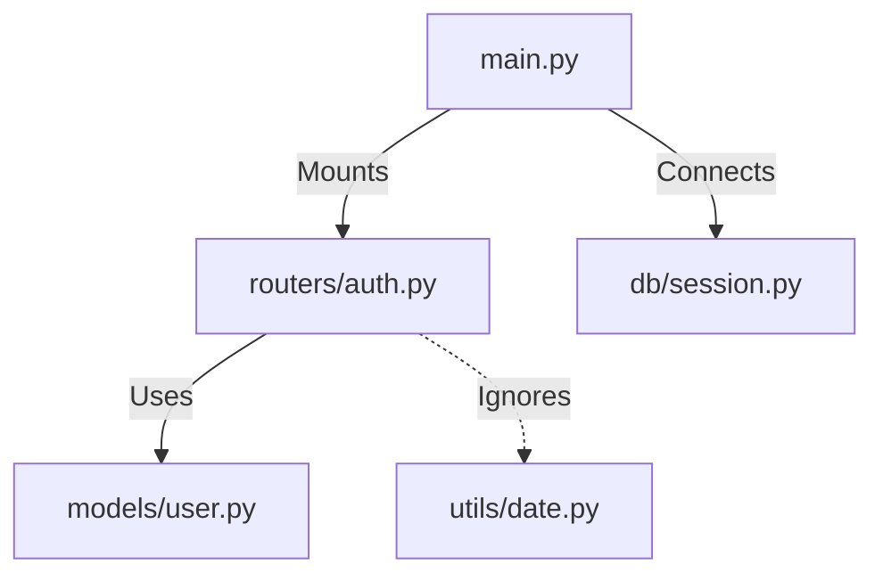

# Strategy: The Living Tree (Smart Traversal)

## Concept
Instead of analyzing every file in alphabetical order (which is inefficient and noisy), the system will mimic how a human developer reads code: **Following the thread of execution**.

The "Tree" is not just the output; it is the **map of exploration**.

## The Flow: "Director & Explorer"

We elevate the **Architect** to be the "Director" of the analysis, while the **Miner** remains the "Explorer".

### 1. Identify the Seed (Entry Point)
The system must identifying the logical starting point of the application.
*   **Static Heuristics**: Look for `main.py`, `index.js`, `app.ts`, `wsgi.py`, `manage.py`.
*   **AI Discovery**: If no obvious entry point exists, ask the Miner to scan the root directory and guess the entry point based on file names and `package.json`/`pyproject.toml`.

### 2. Recursive Discovery Loop
Once the entry point (e.g., `main.py`) is identified:

1.  **The Director (Architect)** sends the **Explorer (Miner)** to analyze `main.py`.
2.  **The Explorer returns**:
    *   **Conclusions**: "Initializes FastAPI app", "Mounts Auth Router", "Connects to DB".
    *   **Leads (References)**: "Imports `app/routers/auth.py`", "Imports `app/db/session.py`".
3.  **The Director decides**:
    *   "The Auth Router seems critical -> **High Priority** scan for `app/routers/auth.py`."
    *   "The `utils/date_helper.py` seems trivial -> **Skip** or Low Priority."
4.  **Repeat**: The Director adds the chosen leads to the queue and continues the process recursively.

## Why this is better?
1.  **Context-Aware**: The documentation hierarchy naturally follows the architecture (Root -> Router -> Controller -> Service).
2.  **Efficiency**: We avoid analyzing thousands of unrelated utility files unless they are specifically imported by critical components.
3.  **Coherence**: The "Tree of Truth" is built organically during the traversal, not reconstructed artificially at the end.

## The Output: A Knowledge Graph
The result is not just a list of facts, but a directive graph of how the project *actually works*.

