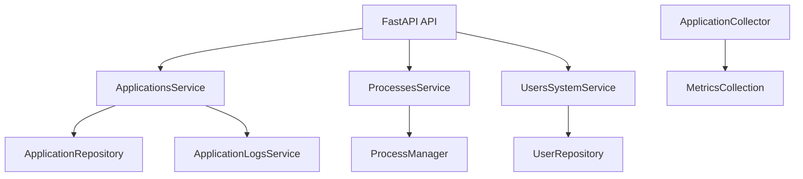

# Architecture Overview

# Architecture Overview

## Introduction
The IRA subsystem provides process management, metrics collection, and user management through a finely structured architecture that utilizes FastAPI for serving requests, SQLAlchemy for data manipulation, and various modules for achieving core functionalities, including monitoring system performance and managing applications.

## Architecture & Patterns
The architecture of the IRA subsystem employs several key patterns:

### Service Layer Pattern
The subsystem encapsulates its business logic within services, such as `ProcessesService`, `UsersSystemService`, and `ApplicationsService`. These services provide reusable methods for managing resources, ensuring separation of concerns. For example, `ProcessesService` facilitates querying the state of system processes and their metrics while `UsersSystemService` focuses on the management of user-related operations.

### Dependency Injection
FastAPI's dependency injection capabilities are leveraged extensively. For instance, in the application API layer, the `get_session` function is used to provide an `AsyncSession` instance for efficient database interactions, promoting clean and testable code.

### Asynchronous Programming
Asynchronous programming is utilized throughout the application to enhance responsiveness, particularly in API endpoints and background tasks. Functions such as `collect_application_metrics` and endpoint operations use async/await syntax to run I/O-bound operations without blocking the main execution thread, contributing to higher throughput.

### Error Handling
Error handling is methodical across the subsystem. For example, within `ProcessesService`, exceptions logged at the debug level ensure that failures in process data collection are recorded without halting execution. Similarly, API layers raise `HTTPExceptions` for error responses, centralizing the error management approach and maintaining user clarity.

## Component Breakdown
The subsystem can be broken down into several key components:

### Process Management
- **File: `ira/proccess.py`**  
  - Uses the `scan_processes` function allowing for filtering of running processes based on their execution time and lifecycle.
  - It prints essential runtime information for monitoring purposes, enhancing debuggability.

### Application Management
- **File: `ira/app/services/applications/applications.py`**  
  - The `ApplicationsService` manages CRUD operations through `ApplicationRepository`, optimizing database interactions for application entities. 
  - Error handling mechanisms ensure the graceful handling of operations on non-existent applications.

### Metrics Collection
- **Files: `ira/app/services/collector/application_collector.py`, `ira/app/services/application_metrics_service.py`**  
  - These services are dedicated to collecting metrics from applications, both general and specific, allowing for detailed performance tracking and reporting.

### User Management
- **File: `ira/app/services/user_system_service.py`**  
  - `UsersSystemService` retrieves and categorizes users, enabling user management operations which can filter for active, human, and system users.

### Back-end Integration
- **File: `ira/app/api/logs.py`**  
  - Provides WebSocket integration for real-time log streaming based on application ID, ensuring that log data delivery is dynamically managed.

### Configuration Management
- **File: `ira/app/config/ira.config.json`**  
  - Maintains configurations that define how the application interacts with external systems and services, highlighting module dependencies and server settings.

## Data Flow
Data flow within the IRA subsystem begins with API requests handled by FastAPI, which route the requests to their respective service methods via dependency injection. For instance, when an application request is made, the related methods from `ApplicationsService` are triggered, which in turn may invoke other services (e.g., logging metrics) or database actions via the `AsyncSession` provided by the `get_session` function. Thus, data transitions from HTTP requests to database interactions seamlessly.

## Diagram

## Configuration & Dependencies
Key environment configurations include:
- `IRA_DATABASE_DSN` or `DATABASE_URL`: Required for database access.
- Application runs on specific ports set in environment variables.
- Dependencies on various modules and libraries outlined across the subsystem for full functionality, including essential utilities and integrations.

## Key Technical Decisions
- **Use of FastAPI**: Chosen for its asynchronous capabilities, facilitating high concurrency handling.
- **Structured Service Layer**: Promotes clear separation of concerns and better unit testing capabilities.
- **Asynchronous Database Operations**: Ensures system responsiveness during I/O-bound operations reducing contention.
- **Strong Error Handling**: Consistent error management practices throughout the application’s architecture, ensuring reliability and user guidance in case of failures.

## Diagram

