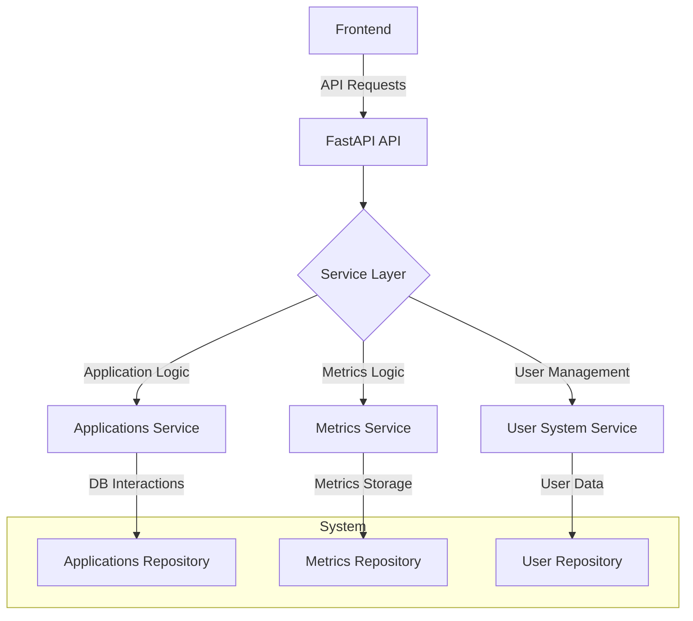

# Architecture Overview

# Architecture Overview

## Introduction

The subsystem serves as an integrated architecture for providing application management, metrics collection, and user interaction functionalities. It encapsulates various components responsible for process management, logging, system monitoring, and extension handling, utilizing FastAPI for API exposure. The structure emphasizes modularity and asynchronous operations, enabling efficient scaling and responsiveness in a web application environment.

## Architecture & Patterns

The architectural design leverages several key patterns:

1. **Modular Architecture**: The system is divided into several modules (`ira`, `frontend`, `extensions`, `services`, etc.), each managing specific functionalities. For instance, metrics collection is handled in `ira/app/services/collector`, while user management resides in `ira/app/services/user_system_service.py`. This division enhances maintainability and allows independent development and testing of each module.

2. **Dependency Injection**: The utilization of FastAPI's `Depends` mechanism for managing `AsyncSession` instances across various endpoints exemplifies an effective use of dependency injection, promoting separation of concerns. This pattern is evident in `ira/app/api/applications.py`, where the session is injected to facilitate database interactions efficiently.

3. **Asynchronous Programming**: Many functions across the system, such as those in `ira/app/services/processes_service.py`, leverage `async/await` for non-blocking operations, allowing concurrent execution and improving responsiveness.

4. **API-Oriented Design**: The subsystem exposes its functionalities through well-defined FastAPI endpoints, providing a structured interface for client interactions. Each API route is linked with a service layer abstraction, enhancing code readability and encapsulating business logic, as seen in the implementations in `ira/app/api/applications.py` and `ira/app/api/metrics.py`.

## Component Breakdown

The subsystem is composed of the following key components:

### 1. Process Management
- **File**: `ira/proccess.py`  
  - Imports `scan_processes` from `app.modules.scanner.process`, iterating through process instances that have been running for at least 15 seconds. This is critical for filtering and monitoring long-running processes.
  
### 2. Docker Configuration
- **File**: `ira/Dockerfile`  
  - Configures the environment with specific variables like `PYTHONDONTWRITEBYTECODE`, sets the base image to `python:3.12-slim`, and specifies the command to run the app using Uvicorn on port 8000.

### 3. Application Management
- **File**: `ira/app`  
  - Hosts the main FastAPI application in `main.py`, featuring CORS middleware, logging, and lifecycle management, which prepares the context for background tasks and service startup.
- **Service Management**: The `ApplicationsService` facilitates CRUD operations and integrates with logging functionalities, ensuring cohesive management of application metadata.
  
### 4. Metrics Collection
- **File**: `ira/app/services/collector/application_collector.py`  
  - Manages collection of metrics based on application types. It orchestrates calls to various metrics functions while leveraging asynchronous capabilities for efficient data handling.

### 5. Logging
- **File**: `ira/app/api/logs.py`  
  - Manages real-time log streaming via a `WebSocket` endpoint, ensuring logs can be streamed to clients as they occur, emphasizing the need for up-to-date information visibility.
  
### 6. Extension Management
- **File**: `ira/app/services/extensions/extension_status_service.py`  
  - Manages dynamic loading of extensions, encapsulating functionality specific to each extension into structured service classes that integrate with the main application workflow.

### 7. User Management
- **File**: `ira/app/services/user_system_service.py`  
  - Manages user information, filtering, and providing statistics on user activity, leveraging system calls to extract user data from the underlying OS.

## Data Flow

Data moves through the system via APIs defined in the FastAPI framework. For instance, when a client requests application metrics:
1. The API receives the request which triggers the corresponding method in the `ApplicationMetricsService`.
2. This service interacts with the `ApplicationMetricsRepository`, querying the database asynchronously to retrieve the necessary records.
3. Metrics are then returned as JSON responses to clients, allowing the frontend to present real-time data dynamically.

## Diagram

## Configuration & Dependencies

### Environment Variables
- `PYTHONDONTWRITEBYTECODE`: Prevents Python from writing `.pyc` files.
- `PYTHONUNBUFFERED`: Ensures that output from Python scripts is shown in real-time.
- `IRA_DATABASE_DSN` or `DATABASE_URL`: Required for database connectivity.

### Dependencies
- FastAPI for building APIs.
- SQLAlchemy for database interactions.
- Docker for containerization.

## Key Technical Decisions

- Use of **FastAPI** for its asynchronous capabilities, providing non-blocking operations crucial for web applications.
- Implementation of **async ORM** with SQLAlchemy to maintain responsiveness under high load scenarios.
- Modular architecture pattern chosen to separate responsibilities into distinct files and directories, enhancing maintainability and scalability of the codebase.
- Extensive use of *typed data models*, enforced by Pydantic for data validation, ensuring robustness in API communication.

This overview encapsulates the essential components and architecture of the subsystem, providing a foundation for both development and operational understanding.

## Diagram

## Related Files

- `ira/proccess.py`
- `ira/Dockerfile`
- `ira/app/main.py`
- `ira/app/services/applications.py`
- `ira/app/services/collector/application_collector.py`
- `ira/app/api/logs.py`
