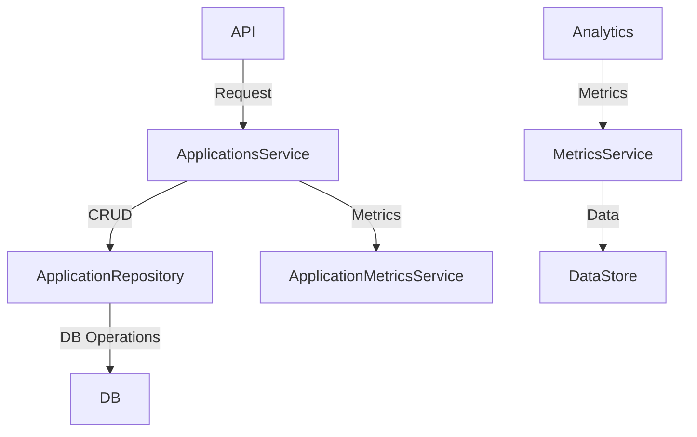

# Architecture Overview

# Architecture Overview

## Introduction
The IRA subsystem is designed to manage processes, applications, and system metrics efficiently. Its architecture consists of multiple modules that handle specific functionalities such as process management, application monitoring, metrics collection, and extensions for AI interactions. Each module adheres to principles of modularity and separation of concerns, ensuring a scalable and maintainable system.

## Architecture & Patterns
The IRA subsystem integrates several architectural patterns:

1. **Microservices Architecture**: The use of separate modules (e.g., `ira/app/services`, `ira/app/modules`, and `ira/app/extensions`) indicates a microservices approach where each module encapsulates specific capabilities such as user management, metrics collection, and application monitoring.

2. **Dependency Injection**: Presented in the services and repositories, where AsyncSession is provided via the `Depends` mechanism from FastAPI. This enhances testability and modularity, allowing for the easy swapping of implementations.

3. **Asynchronous Programming**: The overall architecture emphasizes asynchronous operations (utilizing async/await), which improves responsiveness, especially in database interactions and metrics collection.

### Implementation Example
- The **ApplicationsService** class uses dependency injection to manage `AsyncSession` from SQLModel:
  ```python
  async def create_application(data: CreateApplicationRequest) -> Application:
      async with AsyncSessionLocal() as session:
          ...
  ```

## Component Breakdown
### 1. Process Management
- **File**: `ira/proccess.py`
  - **Process Management**: Imports `scan_processes`, allowing the filtering of processes based on their runtime duration, focusing on processes with an execution time of at least 15 seconds.
  - **Output Handling**: Prints details such as `pid`, `comm`, `etimes`, and truncated `cmdline` for monitoring purposes.

### 2. Application Services
- **File**: `ira/app/services/applications/applications.py`
  - **Data Management**: Manages CRUD operations for Application entities, utilizing `ApplicationRepository` to ensure efficient database interactions.
  - **Concurrency**: Implements asynchronous functionality to smoothly handle concurrent requests to create, update, and delete applications.

### 3. Metrics Collection
- **File**: `ira/app/services/collector/application_collector.py`
  - **Metrics Collection**: Uses asynchronous methods to collect metrics, determining collection strategies based on application type, enhancing flexibility in operations.

### 4. User Management
- **File**: `ira/app/services/user_system_service.py`
  - **User Filtering**: Uses methods like `get_login_allowed_users()` and `get_active_users()` to efficiently manage and filter user data based on specific criteria like shell access.

### 5. Extension Management
- **File**: `ira/app/services/extensions/extension_status_service.py`
  - **Service Management**: Handles dynamic management of extensions based on filesystem structure, ensuring extensibility.

## Data Flow
Data within the IRA subsystem flows through multiple layers:
- **Input Layer**: Users or automated systems invoke APIs defined by FastAPI.
- **Service Layer**: The services process requests, interact with repositories, and manage application data.
- **Database Layer**: Using SQLAlchemy's AsyncSession, services communicate with the database to store and retrieve pertinent information, ensuring a smooth flow of data through various operational states.

### Example Flow
When a request to create an application is received:
1. The API endpoint receives the request and validates input.
2. Control passes to `ApplicationsService`, which uses a repository to persist the application in the database.
3. Relevant metrics collection is initiated asynchronously to capture application performance statistics post-creation.

## Diagram


## Configuration & Dependencies
### Environment Variables
- `IRA_DATABASE_DSN` or `DATABASE_URL`: Required for database connection.

### Docker Configuration
- **Dockerfile Environment Variables**: Configures Python environment for performance optimizations by preventing `.pyc` file generation and enabling unbuffered logging.
- **Ports**: The application exposes port 8000 for web interactions.

## Key Technical Decisions
- **Choice of FastAPI**: FastAPI's asynchronous features were chosen for their performance capabilities, allowing for efficient handling of concurrent connections and scalable service architecture.
- **Use of SQLAlchemy**: Opted for its ORM capabilities and asynchronous support, promoting type safety and structured interactions with the database.
- **Incorporation of Docker**: Docker is utilized for encapsulating the application environment, ensuring consistent deployments and simplifying dependency management.

This architecture overview illustrates the modular design of the IRA subsystem, highlighting its functionality, interactions, and configurations essential for maintaining an efficient and scalable environment for managing applications and system-level metrics.

## Diagram


