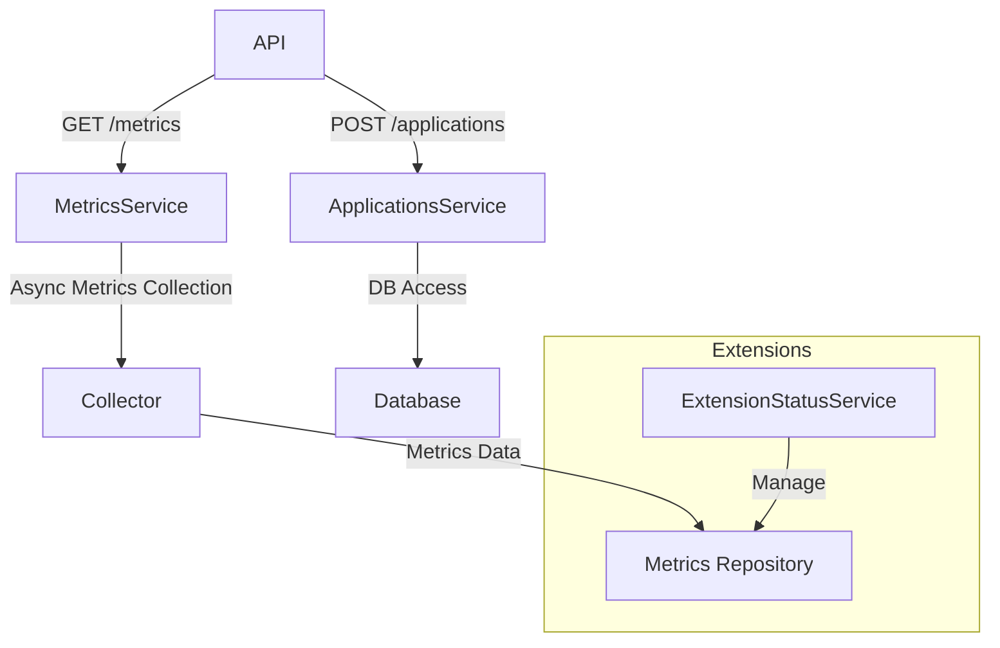

# Project Overview

# Project Overview

## 1. Introduction
This project is structured as a modular software architecture designed to manage and monitor system processes, application metrics, user data, and network interactions. Its role encompasses process management, metrics collection, user management, and extension handling, facilitating an efficient and scalable environment that supports a variety of functionalities from system monitoring to web services.

## 2. Architecture & Patterns
The architectural patterns utilized in this project reflect a clear separation of concerns, promoting modularity and maintainability. Each subsystem is encapsulated within distinct modules, enabling independent development and testing.

### 2.1 Modular Architecture
Each module is dedicated to a specific functionality, e.g., `ira/app/services` for service layer interactions, `ira/app/api` for RESTful endpoints, and `ira/app/extensions` for handling AI chat extensions.

### 2.2 Asynchronous Programming
Many components leverage asynchronous programming patterns, such as FastAPI’s support for async/await in endpoints, ensuring non-blocking operations which enhance performance under load. This can be seen in API routes like `/metrics/series` that utilize async methods to facilitate efficient data retrieval without hindering user requests.

## 3. Component Breakdown

### 3.1 Process Management
- **Module:** `ira/app/modules/system/proc.py`
    - *`read_process_cmdline(pid: str)`*: Retrieves command line arguments for a specified process.
    - *`list_pids()`*: Lists currently running process IDs from the `/proc` filesystem.

### 3.2 Metrics Collection
- **Class:** `ApplicationService`
    - Handles CRUD operations related to Applications via `ApplicationRepository`.
- **Method:** `collect_application_metrics`
    - Collects metrics according to the type of application, indicating a direct interaction with various metric collection functions based on the application context.

### 3.3 User Management
- **Class:** `UsersSystemService`
    - Manages user-related actions such as retrieving active and all users.
    - *Methods:* Filters users based on criteria like shell types and categorizes them into human and system types.

### 3.4 Extension Handling
- **Service:** `ExtensionStatusService`
    - Manages the status of extensions, ensuring they are loaded and functional based on their configuration files found in the extensions directory.

## 4. Data Flow
Data flows through the system primarily via API requests and internal service invocations. API endpoints defined in the FastAPI framework accept client requests, interact with the relevant services for business logic, and return structured data, often in JSON format. For example, endpoints in `ira/app/api/applications.py` allow for the creation and management of application-related data.

## 5. Diagram

## 6. Configuration & Dependencies
- **Environment Variables:** Configuration relies on variables such as `IRA_DATABASE_DSN` for database connections. 
- **Ports:** Various services are configured to listen on specific ports as defined in Dockerfiles and configuration scripts (e.g., port 3001 for backend services).

## 7. Key Technical Decisions
- **Asynchronous Framework Utilization:** The choice of FastAPI reflects a preference for performance and scalability through asynchronous features, optimizing how the system handles multiple incoming requests. 
- **Modularity:** The decision to encapsulate functionalities into distinct modules supports both clarity in design and ease of maintenance, ensuring that changes in one module minimally impact others.
